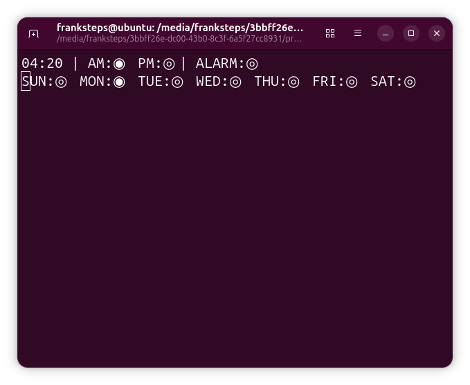
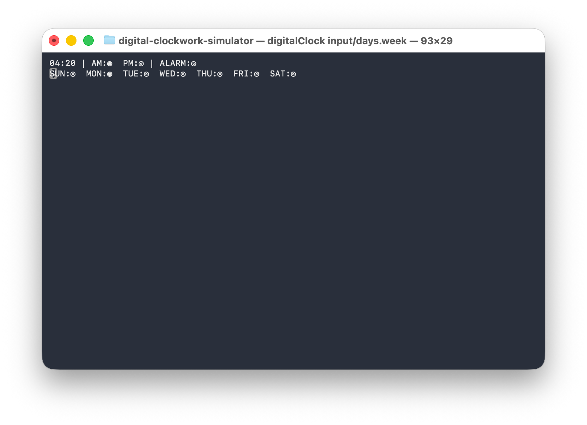
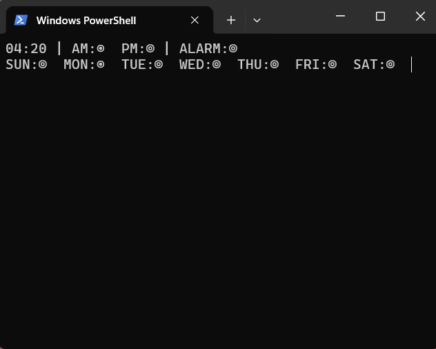

# A Digital Clockwork Simulator


Viddy well, little brother. This project is queer, queer like a clockwork orange!

**A Digital Clockwork Simulator** is a digital clock circuit simulator inspired by a project created by Wagner Rambo and presented on his YouTube channel, **WR Kits**.

This simulator was developed as a way to study digital circuit behavior, low-level hardware concepts, discrete logic, and the internal operation of integrated circuits such as **CD4017**, **CD4029**, **CD4511**, and others used in the original design.

## The Original Project

This horrorshow is based on a digital clock circuit designed by Wagner Rambo and showcased on his YouTube channel: **WR Kits**.
Below is an image of the original hardware project:


## Purpose of This Repository

This repository serves as a personal experimental environment for:

* Studying digital circuit behavior through simulation
* Exploring low-level hardware concepts
* Implementing circuit logic in **C++**
* Experimenting with the simulation of discrete logic components

## Extensions

1. As a final assignment for the Digital Systems course, offered by the Computer Department at Universidade Federal de Sergipe (UFS) and taught by Prof. Dr. Calebe Micael de Oliveira Conceição and Prof. Rodolfo Botto de Barros Garcia, we were challenged to extend the Digital Clockwork with a fully functional alarm system.

## Operating System Compatibility

The simulator runs on **Linux, Windows, and macOS**. Keyboard capture is implemented separately for each platform behind a common interface (`include/keyboard.hpp`):

| Platform | Implementation file                 | Mechanism                                                        |
|----------|-------------------------------------|------------------------------------------------------------------|
| Linux    | `src/keyboard_linux.cpp`            | `libevdev`, reading raw kernel events from `/dev/input/eventX`   |
| Windows  | `src/keyboard_windows.cpp`          | `GetAsyncKeyState` (WinAPI), polling-based, no window required   |
| macOS    | `src/keyboard_macintosh.cpp`        | `CGEventTap`, system-wide event tap, no window required          |

Audio feedback (the alarm buzzer) follows the same pattern behind `include/audio_output.hpp`:

| Platform | Implementation file                 | Mechanism                                                        |
|----------|-------------------------------------|------------------------------------------------------------------|
| Linux    | `src/audio_output_linux.cpp`        | ALSA (`libasound`), blocking `snd_pcm_writei` writes             |
| Windows  | `src/audio_output_windows.cpp`      | WinMM (`waveOut*`), blocking buffer writes                       |
| macOS    | `src/audio_output_macintosh.cpp`    | CoreAudio `AudioQueue`, callback-driven buffer fill              |

As with the keyboard, only one of these three files is compiled per platform, and `main.cpp` only interacts with `Buzzer` through the interface declared in `audio_output.hpp`.

Only one of these three files is compiled at a time — the Makefile detects the host OS (`uname -s` on Linux/macOS, `$(OS)` on Windows) and selects the correct one automatically. `main.cpp` is identical across all platforms; it only calls the functions declared in `keyboard.hpp` and never knows which implementation is behind them.

> **macOS note:** `CGEventTap` requires Accessibility permission granted to the compiled binary in *System Settings > Privacy & Security > Accessibility*. Without it, the tap is created successfully but silently receives no events — there is no error message, so if keys don't seem to register, check this first.

## Dependencies

**Common (all platforms):**

* **g++** or **clang++** — C++17 or later
* **make** — build automation tool used to compile the project

**Linux:**

* **libasound2-dev** — ALSA library for audio output
* **libevdev-dev** — keyboard input handling

```bash
sudo apt install g++ libasound2-dev libevdev-dev
```

**Windows:**

* **MinGW-w64** (or another g++/MSVC toolchain with `make` available, e.g. via MSYS2)
* No extra packages: keyboard and audio use `windows.h` (`GetAsyncKeyState`) and `winmm` (`waveOut*`), both included with the toolchain

**macOS:**

* **Xcode Command Line Tools** (`xcode-select --install`) — provides `clang++` and `make`
* No extra packages: keyboard and audio use system frameworks already available (`ApplicationServices`, `Carbon`, `AudioToolbox`)

## Build and Run

To compile and run the Digital Clockwork simulator:

```bash
git clone https://github.com/FrankSteps/digital-clockwork-simulator
cd digital-clockwork-simulator
make clockwork
./builds/digitalClock input/days.week
```

The command is identical on Linux, Windows, and macOS — the Makefile detects the host OS automatically and links the correct keyboard and audio implementation. On Windows, run this from an MSYS2/MinGW shell (or any shell where `g++` and `make` are on `PATH`); on macOS, a standard Terminal with Xcode Command Line Tools installed is enough.

> **Note:** Never run `make` or the compiled binary with `sudo`. Doing so runs the process outside your user session, which breaks ALSA audio output (`Buzzer error: could not open audio device`). If `libevdev` fails to open `/dev/input/eventX` due to a permissions error, add your user to the `input` group instead — see [Known Limitations](#known-limitations) below.

The keyboard input device is hardcoded to `/dev/input/event4` on Linux. If your keyboard is mapped to a different event number, you can check it with:

```bash
cat /proc/bus/input/devices | grep -A5 -i "keyboard"
```

And update the path in `src/keyboard_linux.cpp` accordingly.

## Project Structure

```bash
digital-clockwork-simulator
├── assets                            # Images and graphical resources
│   ├── a_digital_clockwork
│   │   ├── clockwork-board.png
│   │   ├── counter.png
│   │   ├── digital_clockwork_color_logo.png
│   │   ├── dividefreq.png
│   │   └── simulator.png
│   ├── simulator
│   │   ├── linux.png
│   │   ├── macintosh.png
│   │   └── windows.png
│   └── the_amazing_digital_alarm
│       ├── alarm_trigger.png
│       ├── day_comparator.png
│       ├── day_counter.png
│       ├── memory.png
│       ├── project.png
│       ├── the_amazing_digital_alarm_logo.png
│       └── time_comparator.png
├── report                            # project report
│   ├── report.pdf
│   ├── report.tex
│   └── sbc-template.sty
├── include                           # Header files
│   ├── audio_output.hpp
│   ├── chips.hpp
│   ├── digitalAlarm.hpp
│   ├── digitalClockwork.hpp
│   ├── feedback.hpp
│   ├── freqGenerator.hpp
│   ├── keyboard.hpp
│   └── keyState.hpp       
├── input                             # Input configurations to simulate the switches
│   └── days.week
├── src                               # Source code files
│   ├── audio_output_linux.cpp        # Linux audio implementation
│   ├── audio_output_macintosh.cpp    # macOS audio implementation
│   ├── audio_output_windows.cpp      # windows audio implementation
│   ├── chips.cpp
│   ├── digitalAlarm.cpp
│   ├── digitalClockwork.cpp
│   ├── feedback.cpp
│   ├── freqGenerator.cpp
│   ├── keyboard_linux.cpp            # Linux keyboard implementation (libevdev)
│   ├── keyboard_macintosh.cpp        # macOS keyboard implementation (CGEventTap)
│   ├── keyboard_windows.cpp          # Windows keyboard implementation (GetAsyncKeyState)
│   └── main.cpp
├── tests                             # Unit tests
│   ├── 555test.cpp
│   ├── 4013test.cpp 
│   ├── 4017test.cpp 
│   ├── 4029test.cpp 
│   ├── 4040test.cpp
│   ├── 4063test.cpp
│   ├── 4511test.cpp
│   └── frequencytest.cpp
├── .gitignore                       # Git ignored files configuration
├── CONTRIBUTING                     # Guidelines for contributing to the project
├── LICENSE                          # Project license
├── Makefile                         # Build automation file
└── README.md                        # Project documentation
```







## Using the Alarm and the Clockwork

The alarm is configured through a combination of a `.week` file and keyboard controls.

The `.week` file, located in the `input` folder, simulates seven physical ON/OFF switches — one per day of the week. Set `1` to enable the alarm on that day or `0` to disable it:

```bash
# Weekday alarm configuration
# Set 1 to enable the alarm on that day, 0 to disable it
# Lines starting with # are treated as comments

SUN = 0     # comments can be inserted this way
MON = 1
TUE = 1
WED = 1
THU = 0
FRI = 1
SAT = 0
```

Comments are supported via `#`. The remaining configuration is done directly via keyboard:

| Key | Name    | Description                                                                         |
|-----|---------|-------------------------------------------------------------------------------------|
| P   | Program | Latches the current displayed time into the alarm memory — "ring at this time"      |
| A   | Advance | Advances the day-of-week counter on the CD4017                                      |
| D   | Disarm  | Silences the active alarm and clears the stand-by state                             |
| R   | Reset   | Wipes the alarm memory entirely — stored time, meridiem and stand-by                |
| S   | Slow    | Hold to advance the clock slowly — useful for fine time adjustment                  |
| F   | Fast    | Hold to advance the clock faster — useful for setting the time quickly              |

## Known Limitations

* **Duplication across platform files.** `keyboard_linux.cpp`, `keyboard_windows.cpp`, and `keyboard_macintosh.cpp` each implement the same interface independently — there is no shared abstraction between them beyond `keyboard.hpp`. Changing the tracked keys or the edge-detection logic requires updating all three files individually. This tradeoff was accepted to keep `main.cpp` untouched and each platform file self-contained and easy to reason about in isolation, at the cost of manual synchronization.
* **Linux keyboard permissions.** The Linux implementation captures keyboard input via `libevdev`, which requires read access to `/dev/input/eventX`. Add your user to the `input` group and reload it, without using `sudo`:

```bash
  sudo usermod -aG input $USER
  newgrp input
```

* **macOS Accessibility permission.** As noted above, `CGEventTap` requires the compiled binary to be explicitly granted Accessibility permission, or it silently receives no keyboard events.
* **Hardcoded Linux input device.** The Linux implementation reads from `/dev/input/event4` by default; this may need to be changed depending on the host machine's device enumeration (see Build and Run above).
* **Window focus.** Keyboard capture is not tied to window focus on any platform: `libevdev` reads raw kernel events regardless of which window is active, `GetAsyncKeyState` polls global key state system-wide, and `CGEventTap` is a system-wide event tap. This means a tracked key (`F`, `S`, `P`, `A`, `R`, `D`) is registered by the simulator even if another application or window is focused, as long as the program is running.
* **Duplication across platform files (audio).** Like the keyboard implementations, `audio_output_linux.cpp`, `audio_output_windows.cpp`, and `audio_output_macintosh.cpp` each implement the `Buzzer` interface independently, with no shared logic beyond `audio_output.hpp`. This is a deliberate tradeoff for the same reason as the keyboard: each platform file stays self-contained, at the cost of manual synchronization if the tone-generation logic changes.
* **macOS audio buffering.** The CoreAudio implementation is callback-driven (`AudioQueue`) rather than blocking like ALSA/WinMM, so `Buzzer::run()` on macOS just pumps the run loop while the queue's callback pulls samples in the background — this is a structurally different execution model from the other two platforms, even though the public `Buzzer` interface is identical.

## Important Note

This project is **not intended to function as a real digital clock**, droog.
Its purpose is to validate and explore the behavior of Wagner Rambo's original hardware design through computational simulation. The focus is on reproducing the logical behavior of the circuit rather than achieving precise real-time accuracy.

## License

This project is distributed under the **GNU General Public License (GPL)**.
See the `LICENSE` file for more details.

## Fun Facts

> 1. This project's name is a reference to the dystopian novel *A Clockwork Orange* and this README was written using Nadsat terms such as "horrorshow" and "droog".
> 2. The name "The Amazing Digital Alarm" is a reference to the indie animated series *The Amazing Digital Circus*
> 3. Building this little horrorshow was almost as pleasurable as the good old (p)in-out, (p)in-out.
