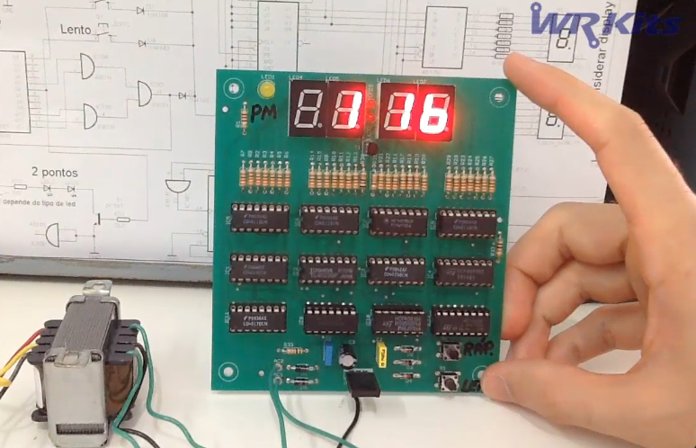

# A Digital Clockwork

**A Digital Clockwork** is a digital clock circuit simulator inspired by a project by Wagner Rambo, presented on his YouTube channel **WR Kits**.

This simulator was developed as a way to study digital circuit behavior, low-level hardware concepts, discrete logic, and the internal operation of integrated circuits such as **CD4017**, **CD4029**, **CD4511**, and others used in the original design.

During my university vacation, this repository serves as a personal experimental laboratory to explore hardware concepts, C++ programming, and digital circuit simulation.

---

## The Original Project

This simulator is based on a digital clock circuit designed by Wagner Rambo and presented on his YouTube channel **WR Kits**.

Below is an image of the original hardware project:



---

## Purpose of This Repository

This repository serves as a personal experimental environment to:

* Study digital circuit behavior through simulation
* Explore low-level hardware concepts
* Implement circuit logic using **C++**
* Experiment with the simulation of discrete logic components

---

## Build and Run

To compile and run the Digital Clockwork simulator:

```
make runClock
```

---

## Important Note

This project is **not intended to function as a real digital clock**.

Its purpose is to validate and explore the behavior of the original hardware design by Wagner Rambo through computational simulation. The focus is on reproducing the logical behavior of the circuit rather than achieving real-time accuracy.

---

## License

This project is distributed under the **GNU General Public License (GPL)**.

See the `LICENSE` file for more details.
