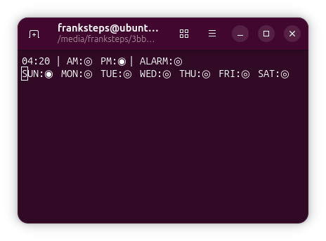

# The Digital Clockwork Simulator

Viddy well, little brother. This project is queer, queer like a clockwork orange!

**The Digital Clockwork Simulator** is a digital clock circuit simulator inspired by a project created by Wagner Rambo and presented on his YouTube channel, **WR Kits**.

This simulator was developed as a way to study digital circuit behavior, low-level hardware concepts, discrete logic, and the internal operation of integrated circuits such as **CD4017**, **CD4029**, **CD4511**, and others used in the original design.

## The Original Project

This horrorshow is based on a digital clock circuit designed by Wagner Rambo and showcased on his YouTube channel: **WR Kits**.
Below is an image of the original hardware project:


## Purpose of This Repository

This repository serves as a personal experimental environment for:

* Studying digital circuit behavior through simulation
* Exploring low-level hardware concepts
* Implementing circuit logic in **C++**
* Experimenting with the simulation of discrete logic components

## Extensions

1. As a final assignment for the Digital Systems course, offered by the Computer Department at Universidade Federal de Sergipe (UFS) and taught by Prof. Dr. Calebe Micael de Oliveira Conceição and Prof. Rodolfo Botto de Barros Garcia, we were challenged to extend the Digital Clockwork with a fully functional alarm system.

* **g++** — C++ compiler with C++17 support
* **make** — build automation tool used to compile the project
* **libevdev** — used for real-time keyboard input detection on Linux

To install it on Ubuntu/Debian:

```bash
sudo apt install libevdev-dev
```

## Build and Run

To compile and run the Digital Clockwork simulator:

```bash
git clone https://github.com/FrankSteps/digital-clockwork-simulator
cd digital-clockwork-simulator
sudo make runClock
```

> **Note:** Running the simulator requires `sudo` because it reads directly from `/dev/input/eventX`, which is a privileged device file on Linux.

```bash
sudo ./builds/digitalClock
```

The keyboard input device is hardcoded to `/dev/input/event4`. If your keyboard is mapped to a different event number, you can check it with:

```bash
cat /proc/bus/input/devices | grep -A5 -i "keyboard"
```

And update the path in `src/digitalClockwork.cpp` accordingly.

## Controls

|   Key   |               Action              |
|---------|-----------------------------------|
|   `F`   | Fast mode — accelerates the clock |
|   `S`   | Slow mode — decelerates the clock |
| Release | Returns to default speed          |

## Project Structure

```bash
digital-clockwork-simulator
├── assets                           # Images and graphical resources
│   ├── clockwork-board.png
│   ├── counter.png
│   └── dividefreq.png
├── docs                             # code and project documentation
│   ├── documentation.pdf
│   └── documentation.tex
├── include                          # Header files
│   ├── chips.hpp
│   ├── digitalAlarm.hpp
│   ├── digitalClockwork.hpp
│   ├── feedback.hpp
│   └── freqGenerator.hpp
├── input                            # Input configurations to simulate the switches"
│   └── days.week
├── src                              # Source code files
│   ├── chips.cpp
│   ├── digitalAlarm.cpp
│   ├── digitalClockwork.cpp
│   ├── feedback.cpp
│   ├── freqGenerator.cpp
│   └── main.cpp
├── tests                            # Unit tests
│   ├── 4013test.cpp 
│   ├── 4017test.cpp 
│   ├── 4029test.cpp 
│   ├── 4040test.cpp
│   ├── 4063test.cpp
│   ├── 4511test.cpp
│   ├── frequencytest.cpp
│   └── keyboardtest.cpp
├── .gitignore                       # Git ignored files configuration
├── LICENSE                          # Project license
├── Makefile                         # Build automation file
└── README.md                        # Project documentation
```

## Dependencies

To build and run this project, the following must be installed:

* **g++** — C++17 or later
* **libasound2-dev** — ALSA library for audio output
* **libevdev-dev** — Linux keyboard input handling

On Debian/Ubuntu:

```bash
sudo apt install g++ libasound2-dev libevdev-dev
```

## Build and run

To compile and run the Digital Clockwork simulator:

```bash
git clone https://github.com/FrankSteps/digital-clockwork-simulator

cd digital-clockwork-simulator

make runClock
```



## Using the Alarm and the Clockwork

The alarm is configured through a combination of a `.week` file and keyboard controls.

The `.week` file, located in the `input` folder, simulates seven physical ON/OFF switches — one per day of the week. Set `1` to enable the alarm on that day or `0` to disable it:

```bash
# Weekday alarm configuration
# Set 1 to enable the alarm on that day, 0 to disable it
# Lines starting with # are treated as comments
SUN = 0     # comments can be inserted this way
MON = 1
TUE = 1
WED = 1
THU = 0
FRI = 1
SAT = 0
```

Comments are supported via `#`. The remaining configuration is done directly via keyboard:

| Key | Name    | Description                                                                         |
|-----|---------|-------------------------------------------------------------------------------------|
| P   | Program | Latches the current displayed time into the alarm memory — "ring at this time"      |
| A   | Advance | Advances the day-of-week counter on the CD4017                                      |
| D   | Disarm  | Silences the active alarm and clears the stand-by state                             |
| R   | Reset   | Wipes the alarm memory entirely — stored time, meridiem and stand-by                |
| S   | Slow    | Hold to advance the clock slowly — useful for fine time adjustment                  |
| F   | Fast    | Hold to advance the clock faster — useful for setting the time quickly              |

## Known Limitations

The current Linux implementation captures keyboard input via `libevdev`, which requires read access to `/dev/input/eventX`. This demands either `sudo` or adding the user to the `input` group via `newgrp input`, which is far from ideal.

A migration to **SDL2** is planned on a dedicated branch, which will eliminate this requirement and make keyboard handling cross-platform and permission-free.

## Important Note

This project is **not intended to function as a real digital clock**, droog.
Its purpose is to validate and explore the behavior of Wagner Rambo's original hardware design through computational simulation. The focus is on reproducing the logical behavior of the circuit rather than achieving precise real-time accuracy.

## License

This project is distributed under the **GNU General Public License (GPL)**.
See the `LICENSE` file for more details.

## Fun Facts

> This project's name is a reference to the dystopian novel *A Clockwork Orange* and this README was written using Nadsat terms such as "horrorshow" and "droog".
> Building this little horrorshow was almost as pleasurable as the good old (p)in-out, (p)in-out.
